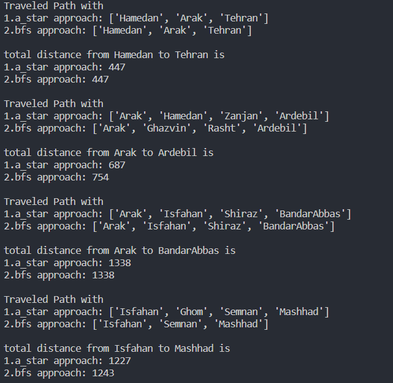

## A* And BFS Search Algorithms

### What is a search Algorithm?
- 
- In the world of computer science, a search algorithm is a technique which helps in solving the search problem.
- These types of algorithms work to recover info stored within some data structure.
- In simple words, we can say that search algorithms are created to inspect for an item or retrieve an item from any data structure where it is kept.
- These algorithms are divided into two groups based on the search operations
- **Informed search algorithms**
  - these Algorithms use a heuristic function that estimates how close a state is to the goal state.
  - and prioritize the states that are more promising.
  - Informed search algorithms are also called heuristic search algorithms.
  - they are more efficient and goal-directed than blind search algorithms.
- **Blind search algorithms**
  - do not use any additional information other than the problem definition.
  - they cannot differentiate between states that are closer or farther from the goal state.
  - Blind search algorithms are also called uninformed search algorithms.
  - they are less efficient and more computationally expensive than informed search algorithms.
  - Examples of blind search algorithms include Breadth-First search, Depth-First search, and Depth-Limited search.
### Assignment Question
- Suppose we want to travel from one Iranian city center to another Iranian city center.
- we want to find a sequence of cities that cover the shortest distance from the origin to the destination.
- Write a program in Python and show the provincial centers that should be visited in order and the length of the route found by your algorithm.

- To do this,we use the A*,BFS search algorithms.
### Assignment Asnwer
### Formulating the goal
- Finding a sequence of cities that have the shortest distance from the origin city to the destination city.
- Whenever we want to turn any kind of problem into a search problem, we need to define six things:
1. A collection of all the states we may end up in
2. Start and end mode
3. A termination check (a way to check if we're in a done state)
4. A set of possible actions
5. A navigation function (a function that tells us where we will get if we go in a certain direction)
6. A set of moving costs from one state to another (which is the weight of the edges in the graph)

### Formulating the problem
* States: Being in different cities
* Actions: Driving between cities

### Finding the solution
* A sequence of cities that have the shortest distance from the origin to the destination.

### Explanation of how A* Algorithm works

* A* is based on the use of heuristic methods to achieve optimal and complete searches.
* it is a type of best-first algorithm.
#### optimality property
* When a search algorithm has the optimality property, it means that it is guaranteed to find the best possible solution, in this case, the shortest path to the termination state.
#### completeness
* When a search algorithm has the property of completeness, it means that if there is a solution to a given problem, the algorithm is guaranteed to find it.

Each time A* enters a state, it calculates the cost f(n) (n is neighboring nodes) to travel to all neighboring nodes and then enters the node with the lowest value of f(n).
These values are calculated with the following formula:

 

* g(n) is the distance of the path traveled from the start node to node n.
* h(n) is a heuristic approximation of the value of the node.

The efficiency of A* is highly dependent on the heuristic value h(n), and depending on the type of problem, we may need to use a different heuristic function to find the optimal solution.
In this implementation of A*, we considered the heuristic value h(n) as the shortest distance between two cities, which is the length of the direct route between the two cities.

In this program we have three files:
### 1. ProvinceCenterDistances.xlsx file
The actual distance of both cities in the table shows that the numbers in this file are used as the weights of the edges of the graph. 
they determine the distance between the two cities.

### 2. ProvinceCentersNeighbors.xlsx file
It shows whether the two cities are adjacent to each other or not. 
If the number in the table is 1, it means that the two cities in the row and column are adjacent to each other, and two cities can be considered in the graph proximity list. 
If the number in the table is zero, it means that the two cities are not adjacent to each other. 
The main purpose of using this file is to create the adjacency matrix for the graph.

### 3. ProvinceCentersStraightLineDistances.xlsx file
The numbers of this file were obtained with the help of google Maps, which shows the <b>shortest distance</b> between two cities.  
h(n) must be acceptable, i.e. the cost of reaching the goal should never be overestimated. 
so we must choose the straight line distance for the revelation of h(n).

#### explanation of some variables in python code:
- <b>open_list</b>
  : is a list of nodes that have been visited, but whose neighbors have not yet been fully explored, starting with the initial node (the root of the tree).
- <b>closed_list</b>
  : is a list of nodes that have been visited and the neighbors of those nodes have been fully inspected.
- <b> Dictionary g </b>
  : contains the current distance from start_node to all other nodes, which defaults to (if not found in the map) +infinity.

Algorithm A* performs the search of a graph for inputs start and destination and returns it as output if there is a path. 
To do this, it uses two lists named opened and closed. 

### How A* Works
The <b> opened list </b> contains the nodes that can be selected and the <b> closed list </b> contains the nodes that have already been selected.
- First, the algorithm calculates the heuristic value of the first node.
- then it adds that node to the opened list (initialization step).
- then removes the primary node from the opened list and place it in the closed list. 
- Then, the algorithm expands the children of the selected node.
- then it calculates the heuristic value of each of them.
- If there is no child in both lists or in the opened list but with a larger heuristic value
 - the corresponding child in the opened list is added at the position of the corresponding node with a higher heuristic value.
 - Otherwise, it will be deleted.
 
At each step, the node with the <b>minimum heuristic</b> value is selected and removed from the opened list.

The entire process terminates when 
* a solution is found
* the opened list is empty, meaning there is no possible solution for the associated problem.

### How the BFS Works
When implementing BFS, we usually use a <b>FIFO</b> structure like Queue to store nodes that will be visited later.
To use Queue in Python, we need to import the corresponding Queue class from the queue module.

We must be careful not to end up in infinite loops by revisiting the same nodes over and over, which can easily happen with graphs that have cycles. 
With this in mind, we keep track of the nodes that have been visited.  
This information does not need to be stored explicitly, we can simply keep track of the parent nodes so that we do not return to one of them after visiting them. 

### Algorithm steps
* Add the root/start node to the Queue.
* For each node, set the node to have no parent defined.
* Until the queue is empty:
* Extract the node from the beginning of the queue.
* Perform the necessary processing on the node.
* For each neighbor of the current node that does not have a parent defined (not visited), add it to the queue and set the current node as its parent.

### Comparison of the BFS and A*
* BFS uses a queue while A* uses a priority queue. In general, queues are much faster than priority queues. 
* The advantage of A* is that it usually spans much fewer nodes than the prime width, but if it doesn't, BFS will be faster.
This can happen if the heuristic used is weak, if the graph is too sparse or small, or if the heuristic fails for a given graph.
* BFS is only useful for unweighted graphs.
If the graph is weighted, we should use Dijkstra's algorithm. 

This algorithm uses a priority queue and it should almost never be faster than A*, except in cases where heuristics fail.
#### EX1: <b>Hamadan to Tehran</b>
As can be seen in the output of the program, in traveling the distance between <b>Hamadan to Tehran</b>
* the route traveled in the A* algorithm is the same as the route traveled in the BFS algorithm.
* the total distance is the same.

#### EX2: <b> Arak to Ardabil</b> 
* A*,BFS routes are different.
* the total distance traveled by the A* algorithm is less than the distance traveled by the BFS algorithm. 
 because when the BFS is a node with a smaller width It observes that it is on the target path, regardless of the weight of the edges. 
 it chooses that node, and since no comparison is made between the weights of the edges, it increases the distance traveled.
#### Results

#### BFS Search
  *	It is an blind search method.
  *	It is complete if the branching coefficient is limited and it is optimal if the cost of each step is equal, then it is not optimal here where the costs are different.
  *	Time complexity and space complexity   Because in this implementation, the node becomes the target after creating the test, so the time and space complexity are both O(b^d).

#### A* Search 
  *	It is a informed search method.
    (When expanding vertices, we can use the knowledge we have and check which vertices are superior to other vertices for expansion)
  *	Unlike searching for the BFS, we use an evaluation function f(n).

